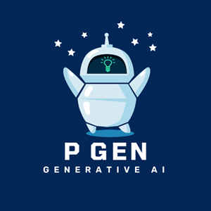

# P Gen - Generative AI 


## Overview
P-GEN is a generative AI API that can understand and respond to queries. It can also read images and answer questions about them.

## Key Features:
Query Response: Get intelligent responses to your text queries.
Image Analysis: Upload images and receive detailed answers based on the image content.
## Usage:
Integrate P-GEN into your applications to enhance user interactions with advanced AI capabilities.
```
https://generative-ai-0y8e.onrender.com/askai?query="What is Capital of India ?"
```

## Whom to Talk ?
Piyush Patel
piyushpatel2053@gmail.com